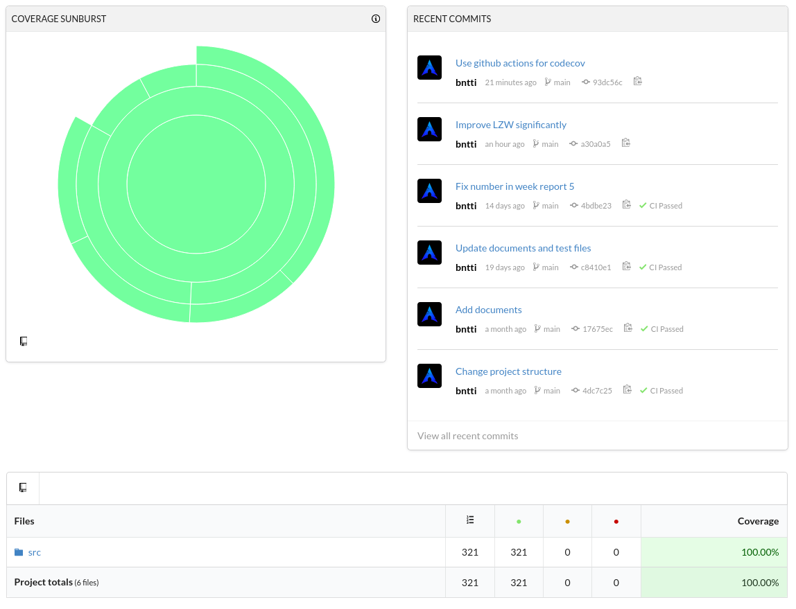

# Testing document
## Code coverage:

  

## Tests
The tests check that:
- file-manager.cpp works
- Compressed files are smaller than the original files for both Huffman and LZW.
- Decompressed files are identical to the original files for both Huffman and LZW.
- Compression and decompression both work with the verbose argument set to true for both Huffman and LZW.

The tests are run with test input files containing miscellaneous data.  
Tests can be replicated by running `make test`.  
Empirical testing data available [here](./Implementation-document.md).